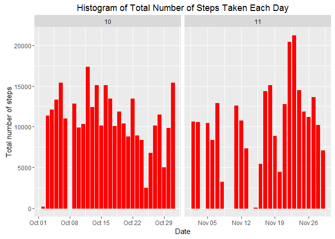
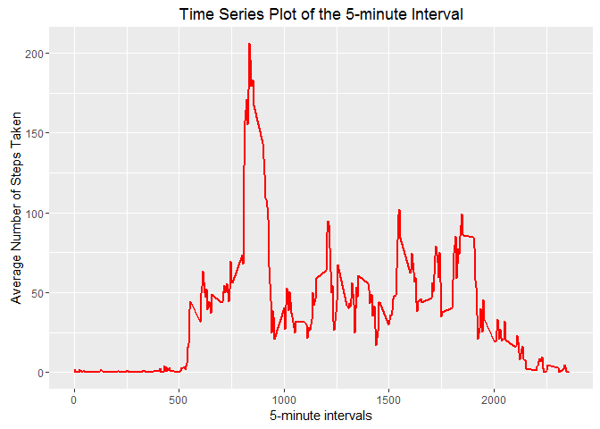
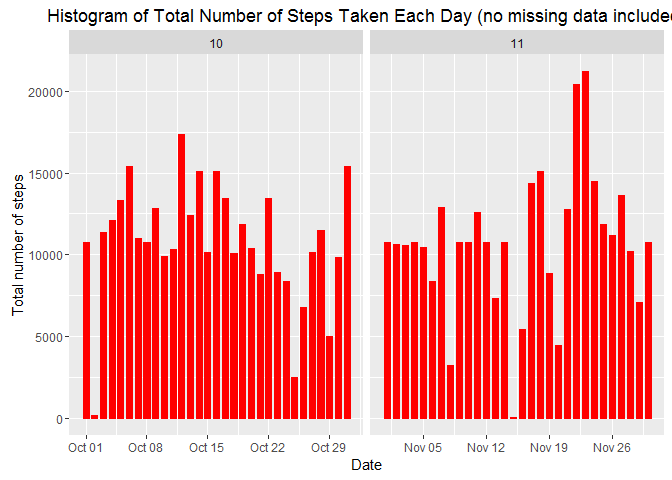
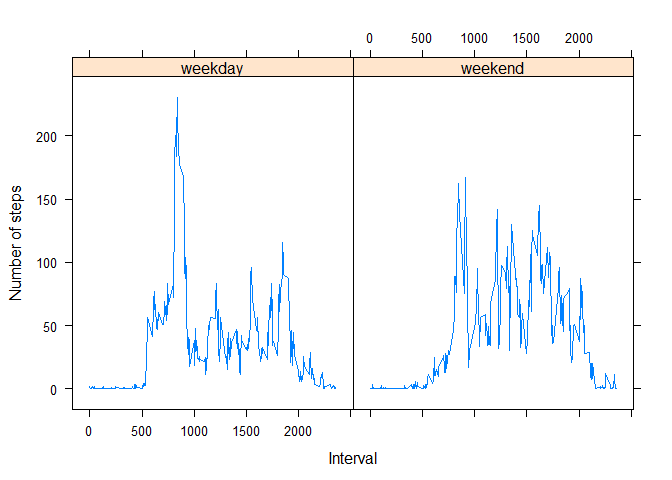

# Reproducible Research: Peer Assessment 1


### Loading and processing the data

```r
echo = TRUE  # Echo R code to user
actdata <- read.csv("activity.csv", colClasses = c("integer", "Date", "factor"))
actdata$month <- as.numeric(format(actdata$date, "%m"))
noNA <- na.omit(actdata)
rownames(noNA) <- 1:nrow(noNA)
library(ggplot2)
```


### What is mean total number of steps taken per day?

* Create a histogram of the total number of steps taken for each day

```r
ggplot(noNA, aes(date, steps)) + geom_bar(stat = "identity", colour = "red", fill = "red", width = 0.7) + facet_grid(. ~ month, scales = "free") + labs(title = "Histogram of Total Number of Steps Taken Each Day", x = "Date", y = "Total number of steps")
```

<!-- -->


* Calculate and report the mean and median total number of steps taken per day

Mean total number of steps taken per day:

```r
totalStepsPerDay <- aggregate(noNA$steps, list(Date = noNA$date), FUN = "sum")$x
mean(totalStepsPerDay)
```

```
## [1] 10766.19
```
Median total number of steps taken per day:

```r
median(totalStepsPerDay)
```

```
## [1] 10765
```
### What is the average daily activity pattern?
* Make a time series plot (i.e. type = "l") of the 5-minute interval (x-axis) and the average number of steps taken, averaged across all days (y-axis)


```r
DailyavgSteps <- aggregate(noNA$steps, list(interval = as.numeric(as.character(noNA$interval))), FUN = "mean")
names(DailyavgSteps)[2] <- "meanOfSteps"

ggplot(DailyavgSteps, aes(interval, meanOfSteps)) + geom_line(color = "red", size = 0.8) + labs(title = "Time Series Plot of the 5-minute Interval", x = "5-minute intervals", y = "Average Number of Steps Taken")
```

<!-- -->

* Which 5-minute interval, on average across all the days in the dataset, contains the maximum number of steps?

```r
DailyavgSteps[DailyavgSteps$meanOfSteps == max(DailyavgSteps$meanOfSteps), ]
```

```
##     interval meanOfSteps
## 104      835    206.1698
```

### Imputing missing values
* Calculate and report the total number of missing values in the datasets. The presence of missing days may introduce bias into some calculations or summaries of the data


```r
sum(is.na(actdata))
```

```
## [1] 2304
```


* Devise a strategy for filling in all of the missing values in the dataset. The strategy does not need to be sophisticated. For example, you could use the mean/median for that day, or the mean for that 5-minute interval, etc.
Create a new dataset that is equal to the original dataset but with the missing data filled in.


```r
newactData <- actdata 
for (i in 1:nrow(newactData)) {
    if (is.na(newactData$steps[i])) {
        newactData$steps[i] <- DailyavgSteps[which(newactData$interval[i] == DailyavgSteps$interval), ]$meanOfSteps
    }
}

head(newactData)
```

```
##       steps       date interval month
## 1 1.7169811 2012-10-01        0    10
## 2 0.3396226 2012-10-01        5    10
## 3 0.1320755 2012-10-01       10    10
## 4 0.1509434 2012-10-01       15    10
## 5 0.0754717 2012-10-01       20    10
## 6 2.0943396 2012-10-01       25    10
```

```r
sum(is.na(newactData))
```

```
## [1] 0
```

* Make a histogram of the total number of steps taken each day and Calculate and report the mean and median total number of steps taken per day. 


```r
ggplot(newactData, aes(date, steps)) + geom_bar(stat = "identity",
                                             colour = "red",
                                             fill = "red",
                                             width = 0.7) + facet_grid(. ~ month, scales = "free") + labs(title = "Histogram of Total Number of Steps Taken Each Day (no missing data included)", x = "Date", y = "Total number of steps")
```

<!-- -->


* Do these values differ from the estimates from the first part of the assignment? What is the impact of imputing missing data on the estimates of the total daily number of steps?

Mean total number of steps taken per day:

```r
newTotalSteps <- aggregate(newactData$steps, 
                           list(Date = newactData$date), 
                           FUN = "sum")$x
newMean <- mean(newTotalSteps)
newMean
```

```
## [1] 10766.19
```
Median total number of steps taken per day:

```r
newMedian <- median(newTotalSteps)
newMedian
```

```
## [1] 10766.19
```
Compare them with the two before imputing missing data:

```r
oldMean <- mean(newTotalSteps)
oldMedian <- median(newTotalSteps)
newMean - oldMean
```

```
## [1] 0
```

```r
newMedian - oldMedian
```

```
## [1] 0
```
So, after imputing the missing data, the new mean of total steps taken per day is the same as that of the old mean; the new median of total steps taken per day is greater than that of the old median.

### Are there differences in activity patterns between weekdays and weekends?

* Create a new factor variable in the dataset with two levels -- "weekday" and "weekend" indicating whether a given date is a weekday or weekend day.


```r
head(newactData)
```

```
##       steps       date interval month
## 1 1.7169811 2012-10-01        0    10
## 2 0.3396226 2012-10-01        5    10
## 3 0.1320755 2012-10-01       10    10
## 4 0.1509434 2012-10-01       15    10
## 5 0.0754717 2012-10-01       20    10
## 6 2.0943396 2012-10-01       25    10
```

```r
newactData$weekdays <- factor(format(newactData$date, "%A"))
levels(newactData$weekdays)
```

```
## [1] "Friday"    "Monday"    "Saturday"  "Sunday"    "Thursday"  "Tuesday"  
## [7] "Wednesday"
```

```r
levels(newactData$weekdays) <- list(weekday = c("Monday", "Tuesday",
                                             "Wednesday", 
                                             "Thursday", "Friday"),
                                 weekend = c("Saturday", "Sunday"))
levels(newactData$weekdays)
```

```
## [1] "weekday" "weekend"
```

```r
table(newactData$weekdays)
```

```
## 
## weekday weekend 
##   12960    4608
```


* Make a panel plot containing a time series plot (i.e. type = "l") of the 5-minute interval (x-axis) and the average number of steps taken, averaged across all weekday days or weekend days (y-axis).


```r
DailyavgSteps <- aggregate(newactData$steps, 
                      list(interval = as.numeric(as.character(newactData$interval)), 
                           weekdays = newactData$weekdays),
                      FUN = "mean")
names(DailyavgSteps)[3] <- "meanOfSteps"
library(lattice)
xyplot(DailyavgSteps$meanOfSteps ~ DailyavgSteps$interval | DailyavgSteps$weekdays, 
       layout = c(2, 1), type = "l", 
       xlab = "Interval", ylab = "Number of steps")
```

<!-- -->

